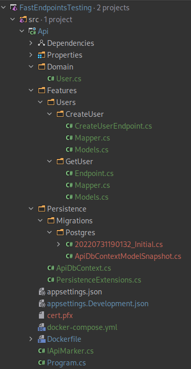

# {$frontmatter.title}

## Integration Testing
:::admonition type="warning"
This document is still a work-in-progress.
Please check back soon...
:::

:::admonition type="tip"
You can have a look at the [test project here](https://github.com/dj-nitehawk/FastEndpoints/tree/v4.1.0/Test) in the meantime to get an idea.
:::

### Route-less Integration Testing

The **recommended** approach to test your endpoints is to perform integration testing using the **WebApplicationFactory**.

```cs |copy|title=terminal
dotnet add package Microsoft.AspNetCore.Mvc.Testing
```

This library offers a set of extensions to the **HttpClient** to make testing more convenient in a strongly-typed and route-less manner. i.e. you don't need to specify the route urls when testing endpoints.

The project we will be testing looks like this:



:::admonition type="tip"
This document will not show you how to build the actual solution. Instead it will focus on the tests.
:::

Follow the simple steps below to start WAF testing your endpoints:

#### Example project setup
The examples will use the following Nuget packages, they are recommendations but not strictly required. Install them in your test project.
```sh
dotnet add package Bogus # we use this to generate realistic looking fake data
dotnet add package FluentAssertings # we use this to write prettier assert statements
dotnet add package Testcontainers # we use this to auto-start docker containers
```

With the Nuget packages in place we can start creating our test suite. We will keep this simple for now, but will expand on it further down the line.

One of the first things we need is a custom implementation of the `WebApplicationFactory` (see [this link](https://docs.microsoft.com/en-us/aspnet/core/test/integration-tests?view=aspnetcore-6.0) for further reference). Our basic implementation looks like this:
```cs | copy title=ApiWebFactory.cs
using System.Linq;
using System.Threading.Tasks;
using Api.Persistence;
using DotNet.Testcontainers.Builders;
using DotNet.Testcontainers.Configurations;
using DotNet.Testcontainers.Containers;
using Microsoft.AspNetCore.Hosting;
using Microsoft.AspNetCore.Mvc.Testing;
using Microsoft.AspNetCore.TestHost;
using Microsoft.EntityFrameworkCore;
using Microsoft.Extensions.DependencyInjection.Extensions;
using Microsoft.Extensions.Logging;
using Xunit;

namespace Api.Test.Integration;

/// <summary>
/// Basic implementation of a WebApplicationFactory.
/// We will use this to spin up a server with our API running.
/// </summary>
/// <remarks>
/// Note that we use the <see cref="IApiMarker"/> interface to reference our API project.
/// We also implement the <see cref="IAsyncLifetime"/> interface to properly initialize and dispose of our used services.
/// </remarks>
public class ApiWebFactory : WebApplicationFactory<IApiMarker>, IAsyncLifetime
{
    // This defines our database container that will get spun up automatically for us for each test
    private readonly TestcontainerDatabase _database = new TestcontainersBuilder<PostgreSqlTestcontainer>()
        .WithDatabase(new PostgreSqlTestcontainerConfiguration
        {
            Database = "testDb",
            Username = "testUser",
            Password = "doesnt_matter"
        })
        .Build();

    // We set up our test API server with this override
    protected override void ConfigureWebHost(IWebHostBuilder builder)
    {
        // We disable any logging-providers for our test.
        // If you would like to use the `ITestOutputHelper` to visualize your log messages take a look at this:
        // https://github.com/martincostello/xunit-logging
        builder.ConfigureLogging(logging =>
        {
            logging.ClearProviders();
        });
        
        // We configure our services for testing
        builder.ConfigureTestServices(services =>
        {
            // remove any DbContextOptions registrations
            var descriptor = services.SingleOrDefault(
                d => d.ServiceType ==
                     typeof(DbContextOptions<ApiDbContext>));
            if (descriptor != null) services.Remove(descriptor);
            
            // Remove any DbContext registrations
            services.RemoveAll(typeof(ApiDbContext));
            
            // Register our DbContext with the test DB connection string provided from our container
            services.AddPersistence(_database.ConnectionString);
        });
    }
    
    public async Task InitializeAsync()
    {
        // Start up our Docker container with the Postgres DB
        await _database.StartAsync();
    }

    public async Task DisposeAsync()
    {
        // Stop our Docker container with the Postgres DB
        await _database.DisposeAsync();
    }
}
```

With this in place we can start with writing our first test.

We will start with the `CreateUserEndpoint`:
```cs |copy
using Api.Persistence;
using FastEndpoints;
using Microsoft.EntityFrameworkCore;

namespace Api.Features.Users.CreateUser;

public class Endpoint : Endpoint<CreateUserRequest, CreateUserResponse, Mapper>
{
    private readonly ApiDbContext _dbContext;

    public Endpoint(ApiDbContext dbContext)
    {
        _dbContext = dbContext;
    }
    
    public override void Configure()
    {
        Verbs(Http.POST);
        Routes("users");
        AllowAnonymous();
    }

    public override async Task HandleAsync(CreateUserRequest req, CancellationToken ct)
    {
        var isAlreadyPresent = await _dbContext.Users.AnyAsync(x => x.Email == req.Email, ct);

        if (isAlreadyPresent)
        {
            Logger.LogInformation("User with this mail is already present");
            AddError(e => e.Email, $"A user with this mail is already present");
        }
        
        ThrowIfAnyErrors();

        var user = Map.ToEntity(req);
        user = _dbContext.Users.Add(user).Entity;
        await _dbContext.SaveChangesAsync(ct);
        
        Logger.LogInformation("User created, Id = '{userId}'", user.Id);

        var response = Map.FromEntity(user);
        await SendCreatedAtAsync<GetUser.Endpoint>(new { id = response.Id}, response, cancellation: ct);
    }
}
```

The tests would like something like this (note: there are still many more tests to write to properly cover the endpoint, but this should get you started):

```cs |copy
using System.Net;
using System.Net.Http;
using System.Threading.Tasks;
using Api.Domain;
using Api.Features.Users.CreateUser;
using Bogus;
using FastEndpoints;
using FluentAssertions;
using Xunit;

namespace Api.Test.Integration.Features.Users;

/// <summary>
/// We use the <see cref="ApiWebFactory"/> as a <see cref="IClassFixture{TFixture}"/> to get it into the tests.
/// </summary>
public class CreateUserEndpointTests : IClassFixture<ApiWebFactory>
{
    private readonly ApiWebFactory _apiWebFactory;
    private readonly HttpClient _client;

    // With this `Faker` from `Bogus` we will create realistic looking test-data
    private readonly Faker<CreateUserRequest> _userRequestGenerator = new Faker<CreateUserRequest>()
        .RuleFor(x => x.FirstName, faker => faker.Name.FindName())
        .RuleFor(x => x.LastName, faker => faker.Name.LastName())
        .RuleFor(x => x.Email, faker => faker.Internet.Email());

    public CreateUserEndpointTests(ApiWebFactory apiWebFactory)
    {
        _apiWebFactory = apiWebFactory;
        // Creating our `HttpClient` to talk to the API started by the `ApiWebFactory`
        _client = apiWebFactory.CreateClient();
    }

    /// <summary>
    /// Testing the happy path
    /// </summary>
    [Fact]
    public async Task User_with_valid_data_is_created()
    {
        // Arrange
        // Generate a realistic looking user request with `Bogus`
        var user = _userRequestGenerator.Generate();
        
        // Act
        // Executing a `POST` call to the `CreateUserEndpoint`, note that we use the extension method `POSTAsync` for this.
        // `POSTAsync` comes from FastEndpoints and allows to easily call the endpoint by targeting the `Endpoint` class 
        // in one of the generic parameters. It also returns the `HttpResponseMessage`
        // and the actual JSON return type `CreateUserResponse`
         var (response, result) = await _client
             .POSTAsync<Endpoint, CreateUserRequest, CreateUserResponse>(user);

        // Assert
        response.Should().NotBeNull();
        response!.StatusCode.Should().Be(HttpStatusCode.Created);
        result.Should().NotBeNull();
        result!.Id.Should().Be(1);
    }

    [Fact]
    public async Task User_with_invalid_mail_is_rejected()
    {
        // Arrange
        const string invalidEmail = "invalidEmail";
        var user = _userRequestGenerator.Clone()
            .RuleFor(x => x.Email, invalidEmail)
            .Generate();

        // Act
        var (response, result) = await _client
            .POSTAsync<Endpoint, CreateUserRequest, ErrorResponse>(user);

        // Assert
        response.Should().NotBeNull();
        response!.StatusCode.Should().Be(HttpStatusCode.BadRequest);
        result.Should().NotBeNull();
        result!.Errors.Keys.Should().Contain(nameof(User.Email));
    }
    
    // There are still a lot of cases left to test, they are pretty much the same structure though, so I left them out
    // for brevity
}
```


## Unit Testing
### Unit Testing Endpoints (FakeItEasy)

If you don't mind paying the price of extra work needed for more granular testing with unit tests, you may use the **Factory.Create&lt;TEndpoint&gt;()** method to get an instance of your endpoint which is suitable for unit testing.

```cs
[TestMethod]
public async Task AdminLoginSuccess()
{
    // Arrange
    var fakeConfig = A.Fake<IConfiguration>();
    A.CallTo(() => fakeConfig["TokenKey"]).Returns("0000000000000000");

    var ep = Factory.Create<AdminLogin>(
        A.Fake<ILogger<AdminLogin>>(), //mock dependencies for injecting to the constructor
        A.Fake<IEmailService>(),
        fakeConfig);

    var req = new AdminLoginRequest
    {
        UserName = "admin",
        Password = "pass"
    };

    // Act
    await ep.HandleAsync(req, default);
    var rsp = ep.Response;

    // Assert
    Assert.IsNotNull(rsp);
    Assert.IsFalse(ep.ValidationFailed);
    Assert.IsTrue(rsp.Permissions.Contains("Inventory_Delete_Item"));
}
```

Use the **Factory.Create()** method by passing it the mocked dependencies which are needed by the endpoint constructor, if there's any.

It has multiple overloads that enables you to instantiate endpoints with or without constructor arguments.

Then simply execute the handler by passing in a request dto and a default cancellation token.

Finally do your assertions on the **Response** property of the endpoint instance.

## Response DTO Returning Handler

If you prefer to return the dto object from your handler, you can implement the **ExecuteAsync()** method instead of **HandleAsync()** like so:

```cs
public class AdminLogin : Endpoint<Request, Response>
{
    public override void Configure()
    {
        Post("/admin/login");
        AllowAnonymous();
    }

    public override Task<Response> ExecuteAsync(Request req, CancellationToken ct)
    {
        return Task.FromResult(
            new Response
            {
                JWTToken = "xxx",
                ExpiresOn = "yyy"
            });
    }
}
```

By doing the above, you can simply access the response DTO like below instead of through the Response property of the endpoint when unit testing.

```cs
var res = await ep.ExecuteAsync(req, default);
```

### Add Route Parameters

For passing down route parameters you will have to alter the HttpContext by setting them in the `Factory.Create`. See the example below:
#### Endpoint
```cs
// Example Endpoint
public class Endpoint : Endpoint<Request, Response>
{
    public override void Configure()
    {
        Verbs(Http.GET);
        Routes("users/{id}");
        AllowAnonymous();
    }

    public override async Task HandleAsync(Request req, CancellationToken ct)
    {
        var user = new Response
        {
            Id = req.Id,
            FirstName = "Jeff",
            LastName = "Bridges"
        };

        await SendAsync(user, cancellation: ct);
    }
}
// Example Request (Id will get mapped from Route)
public class Request
{
    public int Id { get; set; }
}

// Example Response with user info
public class Response
{
    public int Id { get; set; }
    public string FirstName { get; set; }
    public string LastName { get; set; }
}
```

#### Integration Test
```cs
// Example Integration Test
[TestMethod]
public async Task GetSingleUserById()
{
    // Arrange
    var fakeConfig = A.Fake<IConfiguration>();
    A.CallTo(() => fakeConfig["TokenKey"]).Returns("0000000000000000");

    var ep = Factory.Create<Endpoint>(ctx =>
        {
            ctx.Request.RouteValues.Add("id", "1"); // add as many route parameters here as your endpoint needs
        }, 
        // your (mocked) dependencies here
        A.Fake<ILogger<Endpoint>>()
    );

    var req = new Request
    {
        Id = 1
    };

    // Act
    await ep.HandleAsync(req, default);
    var rsp = ep.Response;

    // Assert
    Assert.IsNotNull(rsp);
    // Add other assert statements as necessary
}
```